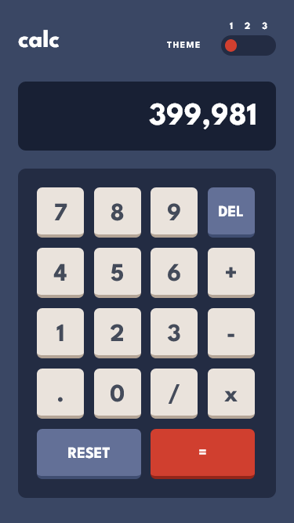
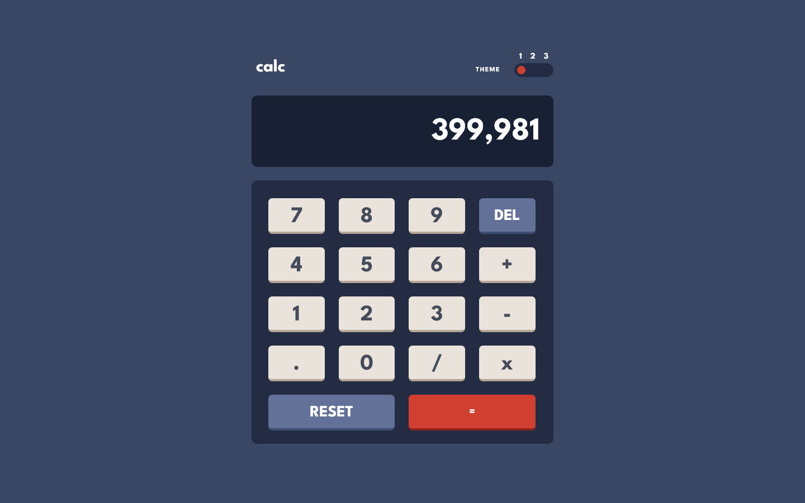

# Frontend Mentor - Calculator app solution

This is a solution to the [Calculator app challenge on Frontend Mentor](https://www.frontendmentor.io/challenges/calculator-app-9lteq5N29). Frontend Mentor challenges help you improve your coding skills by building realistic projects. 

## Table of contents

- [Overview](#overview)
  - [The challenge](#the-challenge)
  - [Screenshot](#screenshot)
  - [Links](#links)
- [My process](#my-process)
  - [Built with](#built-with)
  - [Useful resources](#useful-resources)
- [Author](#author)

## Overview

### The challenge

Users should be able to:

* [x] See the size of the elements adjust based on their device's screen size
* [x] Perform mathmatical operations like addition, subtraction, multiplication, and division
* [x] Adjust the color theme based on their preference
* [x] **Bonus**: Have their initial theme preference checked using `prefers-color-scheme` and have any additional changes saved in the browser

### Screenshot

#### Mobile Result

#### Desktop Result

### Links

- Solution URL: [Repository Project](https://github.com/Samuel-Amaro/calculator-app)
- Live Site URL: [Live Result](https://samuel-amaro.github.io/calculator-app/)

## My process

### Built with

- Semantic HTML5 markup
- CSS custom properties
- Flexbox
- CSS Grid
- Mobile-first workflow
- RWD(Responsive Web Design)
- JavaScript
- Web acessibility
- JavaScript Programming Language
- API DOM JS
- API Web Storage - LocalStorage
- Normalize CSS - [Normalize](https://necolas.github.io/normalize.css/) - Reset CSS
- Methodology BEM(Block Element Modifier) - [BEM](http://getbem.com/introduction/) - Methodology

### Useful resources

- [Article resource](https://web.dev/prefers-color-scheme/) - helped me understand about prefers-colors-scheme
- [Article resource](https://web.dev/building-a-theme-switch-component/) - hepped me build toggle component theme.

## Author

- Website - [Portefólio Samuel Amaro](https://samuel-amaro.github.io/portefolio-website/)
- Frontend Mentor - [@Samuel-Amaro](https://www.frontendmentor.io/profile/Samuel-Amaro)

